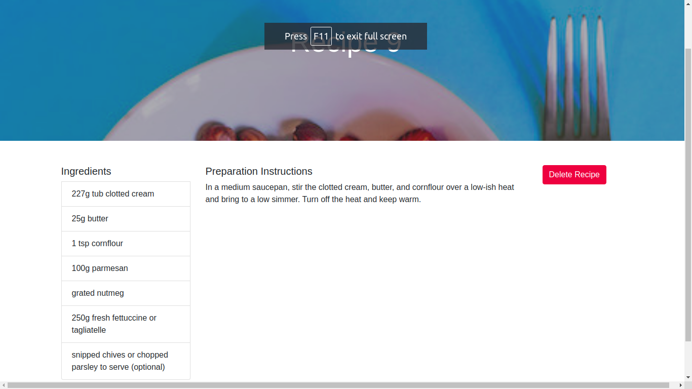

 

# Rails & React Recipes

In this project I:

- Created a Rails Application correctly;
- Configured a React App to display the frontend;
- Created a Recipe Model with the corresponding controller;
- Configured the routes correctly both on Rails and React;
- Connected the React components with the Rails API to view, create and delete Recipes.

# What it does?

- When the App is executed, you will be able to:

  - Get a list of all Recipes created;
  - Create new Recipes;
  - View a single Recipe;
  - Delete a Recipe.

## Built with

- React
- Ruby on Rails
- Bootstrap
- SCSS

## Getting Started

- Clone the repository on your local machine;
- Cd into the folder;
- Run `bundle install`;
- Run `npm install`;
- Run `rails db:create`;
- Run `rails db:migrate`;
- Run `rails db:seed`;
- Run `rails s`;
- Open your browser and type `localhost:3000`.

## Installations

- Install VSCode or any code editor you like;
- Install npm by running `npm install`.

## Author

Murilo Roque Paiva da Silva

Github: [@MuriloRoque](https://github.com/MuriloRoque)

Twitter: [@MuriloRoquePai1](https://twitter.com/MuriloRoquePai1)

Linkedin: [MuriloRoque](https://www.linkedin.com/in/murilo-roque-b1268741/)

## 🤝 Contributing

Contributions, issues and feature requests are welcome! Start by:

- Forking the project
- Cloning the project to your local machine
- `cd` into the project directory
- Run `git checkout -b your-branch-name`
- Make your contributions
- Push your branch up to your forked repository
- Open a Pull Request with a detailed description to the development branch of the original project for a review

## Show your support

Give a ⭐️ if you like this project!